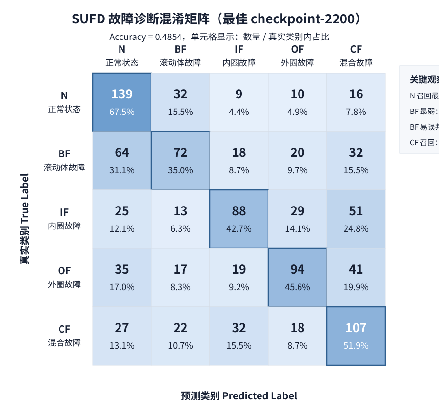

# SUFD-QwenVL 故障诊断实验报告

## 1. 实验目的

本实验目标是验证多模态大模型 Qwen2.5-VL 在工业设备故障诊断任务中的领域适配能力。项目将 SUFD 齿轮箱/轴承振动信号转化为包络时频图，并构造“图像 + 工况文本 + 中文诊断指令”的多模态 SFT 数据，用 LoRA 对 Qwen2.5-VL-3B-Instruct 进行微调。

实验重点包括：

- 验证多模态 SFT 数据构造流程是否可行。
- 比较完整诊断回答和纯分类回答对故障识别性能的影响。
- 分析 LoRA 参数、训练轮数、checkpoint 选择对结果的影响。
- 生成最终可展示的中文诊断报告。

## 2. 数据说明

原始数据为 `.mat` 文件，每个变量形状为：

```text
1048560 × 8
```

8 个通道含义如下：

| 通道 | 含义 | 是否使用 |
|---:|---|---|
| 1 | 电机振动 | 否 |
| 2 | 行星齿轮箱 X 方向振动 | 是 |
| 3 | 行星齿轮箱 Y 方向振动 | 是 |
| 4 | 行星齿轮箱 Z 方向振动 | 是 |
| 5 | 电机转矩 | 否 |
| 6 | 并联齿轮箱 X 方向振动 | 否 |
| 7 | 并联齿轮箱 Y 方向振动 | 否 |
| 8 | 并联齿轮箱 Z 方向振动 | 否 |

本项目只使用第 2、3、4 通道，即行星齿轮箱 X/Y/Z 三方向振动信号。

标签体系：

| 前缀 | 标签 | 中文类别 |
|---|---|---|
| `health` | `N` | 正常状态 |
| `ball` | `BF` | 滚动体故障 |
| `inner` | `IF` | 内圈故障 |
| `outer` | `OF` | 外圈故障 |
| `comb` | `CF` | 混合故障 |

工况包括：

| 工况 | 转速 | 负载/电压 |
|---|---:|---:|
| `20_0` | 20 Hz | 0 V |
| `30_2` | 30 Hz | 2 V |

## 3. 数据预处理方法

数据预处理流程如下：

```text
第 2/3/4 通道原始振动信号
        ↓
4096 点切片，hop=2048
        ↓
简化谱峭度频带搜索
        ↓
带通滤波
        ↓
Hilbert 包络分析
        ↓
包络信号 STFT
        ↓
X/Y/Z 三方向融合为 RGB 图像
```

关键参数：

| 参数 | 值 |
|---|---:|
| 采样率 | 4096 Hz |
| 切片长度 | 4096 |
| 切片步长 | 2048 |
| STFT `nperseg` | 256 |
| STFT `noverlap` | 128 |
| STFT `nfft` | 512 |
| 输出图像尺寸 | 224 × 224 |

简化谱峭度方法并非完整 Fast Kurtogram，而是对多个候选频带进行带通滤波，计算滤波后信号峭度，选择峭度最高的频带作为冲击最显著频带。该方法实现简单、可复现，适合作为项目第一版。

## 4. 数据集划分

由于样本来自长时间序列滑窗切片，且相邻片段之间存在 50% overlap，完全随机划分可能导致相邻样本同时出现在训练集和测试集，从而造成数据泄漏。

因此，本实验采用组内时间顺序划分：

```text
每个 source_field 内：
前 75%：训练集
中间 5%：gap，作为隔离带，不参与训练和测试
后 20%：测试集
```

划分后样本数：

| 数据集 | 样本数 |
|---|---:|
| Train | 3820 |
| Gap | 250 |
| Test | 1030 |

测试集中每个类别均为 206 条样本。

## 5. 多模态 SFT 数据构造

本项目构造了两类 SFT 数据：

### 5.1 完整回答版本

输出包括：

```text
故障类型
诊断依据
维护建议
```

该版本更接近最终 Demo 需求，但早期实验发现长答案会干扰分类学习。

### 5.2 class_only 版本

输出只包含：

```text
故障类型：<滚动体故障/内圈故障/外圈故障/混合故障/正常状态>
```

该版本让模型集中学习五分类任务，显著提升分类指标。

## 6. 模型与训练设置

基座模型：

```text
Qwen2.5-VL-3B-Instruct
```

训练框架：

```text
LLaMA-Factory
```

最佳训练配置：

| 参数 | 值 |
|---|---|
| 微调方式 | LoRA |
| LoRA rank | 16 |
| LoRA alpha | 32 |
| LoRA dropout | 0.05 |
| 学习率 | 8e-5 |
| Epoch | 5 |
| Batch size | 2 |
| Gradient accumulation | 4 |
| 有效 batch size | 8 |
| 精度 | bf16 |
| Template | qwen2_vl |
| Best checkpoint | checkpoint-2200 |

## 7. 实验结果

| 实验 | 数据格式 | 训练设置 | Accuracy | Macro-F1 | 结论 |
|---|---|---|---:|---:|---|
| E1 完整答案版 | 故障类型+诊断依据+维护建议 | r8, lr=1e-4, epoch=3 | 0.2660 | 0.2621 | 长答案生成干扰分类学习 |
| E2 分类版 baseline | 仅故障类型 | r8, lr=1e-4, epoch=3 | 0.3379 | 0.3184 | 分类任务收敛更好 |
| E3 分类版 r16 ep5 | 仅故障类型 | r16, lr=8e-5, epoch=5 | 0.4738 | 0.4683 | LoRA 容量和训练轮数提升有效 |
| E4 最佳 checkpoint | 仅故障类型 | r16, lr=8e-5, epoch=5, ckpt-2200 | **0.4854** | **0.4805** | 当前最佳模型 |
| E5 BF 过采样 2x | 仅故障类型 | r16, lr=6e-5, epoch=5 | 0.3767 | 0.3713 | 简单过采样破坏类别边界 |
| E6 二阶段完整回答 | 完整诊断报告 | 从 E4 继续 SFT, lr=3e-5, epoch=2 | 0.4233 | 0.4096 | 生成能力增强但分类下降 |
| E7 DPO 完整报告偏好优化 | chosen/rejected 完整诊断报告 | 从 E4 继续 DPO, ckpt-400 | 0.4524 | 0.4383 | 跑通偏好优化，但分类指标低于 E4 |
| E8 GRPO 规则奖励优化 | 完整报告生成 + 规则奖励 | 从 E4 继续 GRPO | **0.4874** | **0.4813** | 当前最高总体指标 |

实验表明，class_only 数据格式可以明显提升分类性能；提高 LoRA rank 和增加训练轮数也有显著作用。DPO 能够学习完整诊断报告的偏好关系，但在当前数据规模和偏好构造方式下未超过 SFT best。GRPO 规则奖励优化在 SFT best 基础上带来轻微提升，成为当前最高总体指标。

## 8. Checkpoint 选择

对 `sufd_class_only_r16_ep5` 的多个 checkpoint 进行测试：

| Checkpoint | Accuracy | Macro-F1 |
|---|---:|---:|
| checkpoint-1500 | 0.4068 | 0.4053 |
| checkpoint-1800 | 0.4388 | 0.4182 |
| checkpoint-2000 | 0.4534 | 0.4484 |
| checkpoint-2200 | **0.4854** | **0.4805** |
| checkpoint-2390 | 0.4738 | 0.4683 |

虽然最终 checkpoint 的训练 loss 更低，但测试集指标并非最高。checkpoint-2200 在 Accuracy 和 Macro-F1 上均表现最佳，因此被选为最终分类模型。

## 9. 最佳模型类别级指标

| 类别 | Precision | Recall | F1 | Support |
|---|---:|---:|---:|---:|
| 正常状态 | 0.4793 | 0.6748 | 0.5605 | 206 |
| 滚动体故障 | 0.4615 | 0.3495 | 0.3978 | 206 |
| 内圈故障 | 0.5301 | 0.4272 | 0.4731 | 206 |
| 外圈故障 | 0.5497 | 0.4563 | 0.4987 | 206 |
| 混合故障 | 0.4332 | 0.5194 | 0.4724 | 206 |

## 10. 混淆矩阵分析



行归一化结果：

| True \ Pred | N 正常 | BF 滚动体 | IF 内圈 | OF 外圈 | CF 混合 |
|---|---:|---:|---:|---:|---:|
| N 正常状态 | 67.5% | 15.5% | 4.4% | 4.9% | 7.8% |
| BF 滚动体故障 | 31.1% | 35.0% | 8.7% | 9.7% | 15.5% |
| IF 内圈故障 | 12.1% | 6.3% | 42.7% | 14.1% | 24.8% |
| OF 外圈故障 | 17.0% | 8.3% | 9.2% | 45.6% | 19.9% |
| CF 混合故障 | 13.1% | 10.7% | 15.5% | 8.7% | 51.9% |

主要结论：

- 正常状态召回最高，说明模型较容易识别健康状态。
- 混合故障召回达到 51.9%，但 precision 较低，说明其他故障也容易被预测为混合故障。
- 滚动体故障是当前最弱类别，召回只有 35.0%，主要被误判为正常状态和混合故障。
- IF、OF、CF 之间仍存在互相混淆，说明当前包络 STFT 图像对细粒度故障类型的区分仍有限。

## 11. 强化学习偏好优化实验

### 11.1 DPO 数据构造

本项目在 SFT 最优模型 checkpoint-2200 的基础上继续进行 DPO 偏好优化。DPO 数据采用完整诊断报告偏好对：

```text
chosen：正确故障类型 + 诊断依据 + 维护建议
rejected：错误故障类型 + 诊断依据 + 维护建议
```

该设置的目的不是单纯优化 class_only 分类输出，而是让模型学习工业故障诊断报告中“正确诊断回答”相对于“错误诊断回答”的偏好关系。

### 11.2 DPO 训练结果

| 模型 | 训练方式 | Checkpoint | Accuracy | Macro-F1 | 说明 |
|---|---|---:|---:|---:|---|
| Qwen2.5-VL-3B-Instruct + LoRA | SFT class_only | checkpoint-2200 | **0.4854** | **0.4805** | 当前最佳分类模型 |
| Qwen2.5-VL-3B-Instruct + LoRA | DPO full report | checkpoint-400 | 0.4524 | 0.4383 | DPO 最优 checkpoint，但分类指标低于 SFT best |

DPO checkpoint-400 的混淆矩阵如下：

| True Label | 中文类别 | pred_N | pred_BF | pred_IF | pred_OF | pred_CF |
|---|---|---:|---:|---:|---:|---:|
| N | 正常状态 | 141 | 16 | 7 | 14 | 28 |
| BF | 滚动体故障 | 74 | 46 | 20 | 19 | 47 |
| IF | 内圈故障 | 20 | 11 | 67 | 43 | 65 |
| OF | 外圈故障 | 26 | 4 | 13 | 94 | 69 |
| CF | 混合故障 | 33 | 8 | 24 | 23 | 118 |

训练过程中，DPO training loss 持续下降，rewards/accuracies 持续上升，说明模型能够学习 chosen/rejected 之间的偏好关系。但是验证 loss 随训练逐步上升，且 DPO 最优 checkpoint-400 的 Accuracy 和 Macro-F1 均低于 SFT checkpoint-2200。

### 11.3 DPO 实验结论

当前 DPO 偏好优化虽然增强了模型对完整诊断报告偏好关系的学习，但没有进一步提升故障分类性能。可能原因包括：

1. 当前 DPO 数据规模较小，偏好对主要由模板构造，回答多样性不足。
2. DPO 优化目标关注完整回答偏好，而最终分类指标只评价故障类型是否正确。
3. rejected 样本虽然故障类型错误，但诊断依据和维护建议也由模板生成，难以覆盖真实模型幻觉回答。
4. DPO 继续训练可能导致模型偏向特定回答模式，从而影响原有分类能力。

因此，最终系统仍采用 SFT class_only checkpoint-2200 作为故障分类模型。DPO 实验作为强化学习偏好优化阶段的探索，用于说明项目已经完成 chosen/rejected 偏好数据构造、DPO 训练和 checkpoint 评估。

### 11.4 GRPO 规则奖励优化

在 DPO 实验之后，本项目进一步使用 TRL GRPO 从 SFT 最优模型 checkpoint-2200 继续进行规则奖励优化。GRPO 奖励函数主要包括：

1. 故障类型正确性奖励；
2. 输出格式完整性奖励；
3. 报告质量奖励，包括简洁性和避免多个故障类型互相冲突。

目标是在生成完整诊断报告时进一步强化故障类型判断和报告结构稳定性。

### 11.5 GRPO 训练结果

| 模型 | 训练方式 | Checkpoint / 输出目录 | Accuracy | Macro-F1 | 说明 |
|---|---|---|---:|---:|---|
| Qwen2.5-VL-3B-Instruct + LoRA | SFT class_only | checkpoint-2200 | 0.4854 | 0.4805 | 原最佳分类模型 |
| Qwen2.5-VL-3B-Instruct + LoRA | DPO full report | checkpoint-400 | 0.4524 | 0.4383 | DPO 完整报告偏好优化 |
| Qwen2.5-VL-3B-Instruct + LoRA | GRPO rule reward | sufd_grpo_from_ckpt2200 | **0.4874** | **0.4813** | 当前最高指标 |

GRPO 混淆矩阵如下：

| True Label | 中文类别 | pred_N | pred_BF | pred_IF | pred_OF | pred_CF |
|---|---|---:|---:|---:|---:|---:|
| N | 正常状态 | 142 | 25 | 8 | 14 | 17 |
| BF | 滚动体故障 | 66 | 68 | 20 | 23 | 29 |
| IF | 内圈故障 | 24 | 12 | 86 | 33 | 51 |
| OF | 外圈故障 | 26 | 18 | 15 | 105 | 42 |
| CF | 混合故障 | 29 | 23 | 32 | 21 | 101 |

GRPO 相比 SFT best 获得轻微提升：

```text
Accuracy: 0.4854 -> 0.4874
Macro-F1: 0.4805 -> 0.4813
```

从混淆矩阵看，GRPO 的主要收益来自外圈故障 OF，OF 正确预测数由 SFT best 的 94 提升到 105。但 GRPO 同时略微降低了 BF、IF、CF 的正确预测数，因此总体提升幅度较小。

### 11.6 GRPO 实验结论

GRPO 规则奖励优化能够在 SFT best 的基础上带来轻微性能增益，说明基于故障类型正确性、输出格式完整性和报告质量的奖励函数对该任务有一定帮助。

考虑到 GRPO 指标目前最高，本项目将 GRPO 结果作为当前最优强化学习实验结果；但由于提升幅度较小，仍需要在后续工作中进一步优化奖励函数、训练步数和偏好数据质量。

## 12. 失败实验分析

### 12.1 完整回答版效果较差

完整回答版要求模型同时学习分类、诊断依据生成和维护建议生成。实验中该设置仅达到：

```text
Accuracy: 0.2660
Macro-F1: 0.2621
```

说明在小数据集场景下，长答案生成会稀释分类学习信号。

### 12.2 BF 过采样 2x 效果下降

由于 BF 召回较低，实验尝试将 BF 训练样本复制 2 倍，但结果下降：

```text
Accuracy: 0.3767
Macro-F1: 0.3713
```

说明简单重复样本会破坏整体类别边界，使模型分布学习变差。后续如需改善 BF，应优先考虑图像表示、特征增强或更合理的采样策略，而不是直接复制样本。

### 12.3 二阶段 full-answer 训练冲掉分类能力

从最佳 class_only checkpoint 继续训练完整回答数据后：

```text
Accuracy: 0.4233
Macro-F1: 0.4096
```

结果低于最佳 class_only 模型，说明第二阶段完整回答训练会损失一部分分类能力。

因此最终采用“class_only 分类 + 模板扩展报告”的方案。

## 13. 最终报告方案

最终推理流程：

```text
class_only 最佳模型预测故障类型
        ↓
抽取故障标签
        ↓
根据故障标签和工况参数填充诊断模板
        ↓
输出完整诊断报告
```

示例：

```text
故障类型：滚动体故障
诊断依据：模型判断该包络时频图中存在局部冲击和调制特征，结合行星齿轮箱三方向振动信息，更符合滚动体故障表现。当前工况为 20 Hz、0 V。
维护建议：建议重点检查滚动体表面是否存在磨损、点蚀或剥落，并结合包络谱或现场巡检进一步确认故障程度。
```

该方案保留最佳分类准确率，同时能够输出面向用户的完整中文诊断报告。

## 14. Gradio Demo 展示

为便于演示，本项目实现了 Gradio Demo：

```text
demo/app_gradio.py
```

Demo 输入：

```text
包络 STFT 图像
转速 Hz
负载/电压 V
采样率 Hz
```

Demo 输出：

```text
故障类型
模型原始输出
最终诊断报告
```

启动命令：

```bash
conda activate llamafactory311
cd /root/autodl-tmp/sufd-qwenvl-fault-diagnosis

python demo/app_gradio.py --server-name 0.0.0.0 --server-port 6008
```

AutoDL 端口映射示例：

```text
容器端口：http://127.0.0.1:6008
公网地址：https://<your-autodl-service-url>
```

Demo 默认加载：

```text
Base model:
/root/autodl-tmp/models/Qwen2.5-VL-3B-Instruct

LoRA adapter:
/root/autodl-tmp/LLaMA-Factory/saves/qwen2_5vl_3b/lora/sufd_class_only_r16_ep5/checkpoint-2200
```

该 Demo 已完成端到端测试：上传测试集包络 STFT 图像后，可以输出故障类型、模型原始 class_only 回答，并自动扩展为包含诊断依据和维护建议的中文诊断报告。

## 15. 当前不足

- 最佳 Accuracy 为 0.4874，仍有较大提升空间。
- BF 滚动体故障召回较低，是当前主要瓶颈。
- 当前诊断依据和维护建议是类别级模板，不包含样本级严重程度估计。
- 当前 DPO 偏好数据主要由模板构造，尚未引入人工偏好或模型真实错误回答。
- 当前 GRPO 提升幅度较小，奖励函数仍比较粗粒度。
- 当前只使用 Qwen2.5-VL-3B，尚未验证 7B 模型或其他视觉模型。
- 当前只使用包络 STFT 图像，尚未对比原始 STFT、CWT、包络谱等表示方式。
- 当前 Demo 为单样本诊断，尚未支持批量上传、历史记录和结果导出。

## 16. 后续优化方向

- 尝试 Qwen2.5-VL-7B + QLoRA，观察更大模型是否改善细粒度分类。
- 对比不同图像表示方式，包括原始 STFT、CWT、小波包和包络谱。
- 引入传统特征作为文本输入，例如 RMS、峭度、频带能量、包络谱峰值。
- 增加验证集，自动选择最佳 checkpoint，而不是训练后手动筛选。
- 构造更真实的偏好数据，例如人工标注偏好、模型错误回答采样和多维奖励评分。
- 继续优化 GRPO 奖励函数和训练步数，使奖励更关注易混淆类别。
- 在现有 Gradio Demo 基础上增加批量诊断、历史记录和结果导出功能。
- 针对 BF 类设计更细致的数据增强，而不是简单复制样本。

## 17. 结论

本实验完成了从 SUFD 原始振动信号到 Qwen2.5-VL 多模态微调、DPO 偏好优化和 GRPO 规则奖励优化的完整流程。实验表明，在该任务中，直接训练完整诊断回答会削弱分类性能；将任务先约束为 class_only 分类输出，并提升 LoRA 容量和训练轮数，可以显著提升模型对故障类型的识别能力。

最终 SFT 阶段选择 Qwen2.5-VL-3B-Instruct + LoRA rank 16 + checkpoint-2200 作为最佳分类模型，并通过模板扩展生成完整中文诊断报告。DPO full-report 实验已经跑通 chosen/rejected 偏好训练流程，但当前分类指标低于 SFT best；GRPO rule-reward 实验在 SFT best 基础上获得轻微提升，达到 Accuracy 0.4874、Macro-F1 0.4813，作为当前最高总体结果保留。该方案兼顾了分类性能和结果可展示性，为后续接入 Gradio Demo、7B 模型对比和工业诊断平台化提供了基础。
